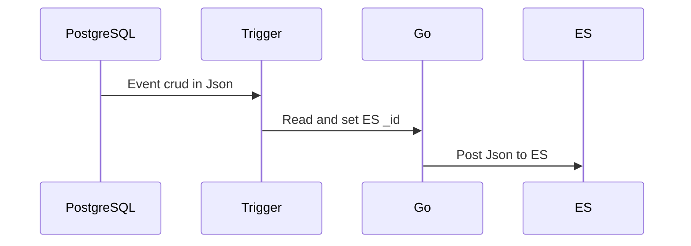

# PostgreSQL To ElasticSearch in Go


# Requirements
Project in **Go + SQL**  to create an ElasticSearch **index** from PostgreSQL database.

This procedure is for a Linux operating system.

The following dependencies needs to be previously installed :
* PostgreSQL (database)
* ElasticSearch (index)
* Docker (containerizer)
* PG Admin (Sql manager)

Two ways to start listening:

  1/ Via PostGresToES.go: this will save the raw data from the database
  2/ Via PostGresToES_ApiGateway.go: this will query the API in order to retrieve JSON which will be indexed in ES

Nothing changes in terms of triggers


# Installation

1. Docker :  https://docs.docker.com/install/
2. PostgreSQL
```
docker pull postgres
docker run --name abcd -e POSTGRES_PASSWORD=abcd -d postgres
```

3. PG Admin
```
docker pull thajeztah/pgadmin4
docker run --restart=always -p 5050:5050 thajeztah/pgadmin4
```
4. ElasticSearch
```
docker pull elasticsearch
docker run --restart=always -d -p 9200:9200 -p 9300:9300 -it -h elasticsearch --name elasticsearch elasticsearch
```

## Configure :
1. Create index :
```
PUT http://localhost:9200/<INDEX_NAME>
{
    "settings" : {
        "index" : {
            "number_of_shards" : 5,
            "number_of_replicas" : 2
        }
    }
}
OR :
curl -XPUT  'http://localhost:9200/<INDEX_NAME>' -d '{"settings" : {"number_of_shards" : 5, "number_of_replicas" : 2}}'
```
2. Create the PostgreSql function :
```
CREATE OR REPLACE FUNCTION public.notify_event()
    RETURNS trigger
    LANGUAGE 'plpgsql'
    COST 100
    VOLATILE NOT LEAKPROOF
AS $BODY$

    DECLARE
        data json;
        notification json;
        id integer;
    BEGIN

        -- Convert the old or new row to JSON, based on the kind of action.
        -- Action = DELETE?             -> OLD row
        -- Action = INSERT or UPDATE?   -> NEW row
        IF (TG_OP = 'DELETE') THEN
            data = row_to_json(OLD);
            id = OLD.id;
        ELSE
            data = row_to_json(NEW);
            id = NEW.id;
        END IF;

        -- Contruct the notification as a JSON string.
        notification = json_build_object(
                          'table',TG_TABLE_NAME,
                          'action', TG_OP,
                          'id', id,
                          'data', data);

        -- Execute pg_notify(channel, notification)
        PERFORM pg_notify('events',notification::text);

        -- Result is ignored since this is an AFTER trigger
        RETURN NULL;
    END;
$BODY$;
```

3. Create the PostgreSql trigger :
```
CREATE TRIGGER products_notify_event
    AFTER INSERT OR DELETE OR UPDATE
    ON public.users
    FOR EACH ROW
    EXECUTE PROCEDURE public.notify_event();
```

4. Install Go
```https://go.dev/doc/install```
5. Init go.mod
```go mod init PostGresToES```
6. Install dependencies
```go mod tidy```
7. Setup (auth, indexName) : https://github.com/120dev/ElasticSearch-postgres/blob/master/PostGresToES.go#L20
8. if PostGresToES_ApiGateway.go : setup conf.yaml
9. Build
```go build PostGresToES.go && chmod +x ./PostGresToES``` or ```go build PostGresToES_ApiGateway.go && chmod +x ./PostGresToES_ApiGateway```
10. Run Go script
```
./PostGresToES or ./PostGresToES_ApiGateway
```
And wait, all events are logged.

# UML diagrams

You can render UML diagrams using [Mermaid](https://mermaidjs.github.io/). For example, this will produce a sequence diagram:


